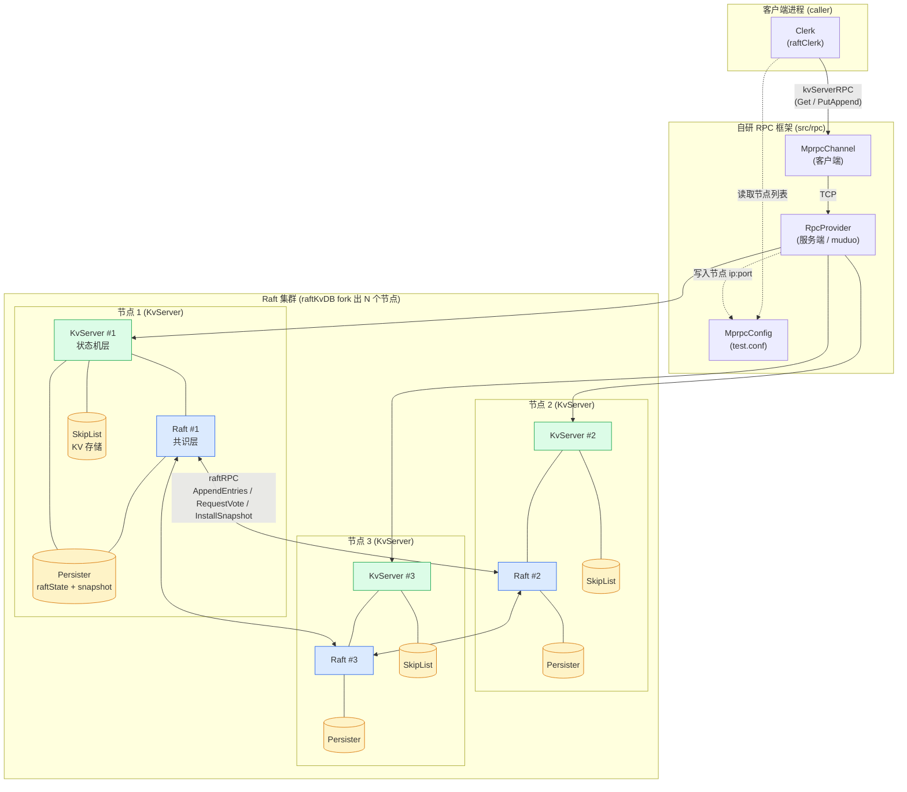
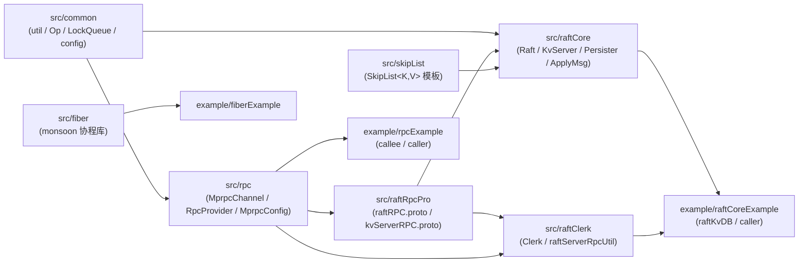
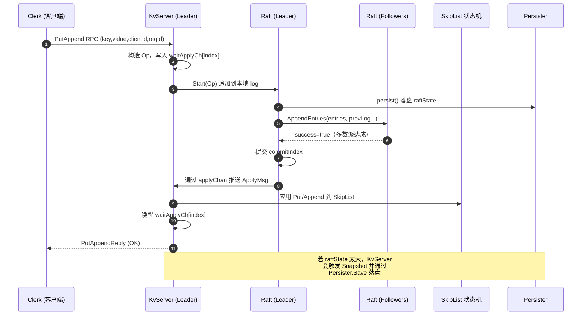
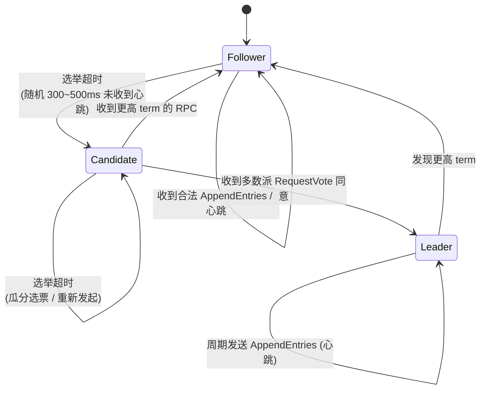

# KVstorageBaseRaft-cpp 项目全景文档

> 一份面向"上手 + 学习"的项目说明文档：包含**整体架构图**、**模块/文件作用清单**、**推荐学习路线**。
>
> 本项目是一个基于 Raft 共识算法的分布式 KV 存储系统，使用 **C++20** 实现，自带：
> - 一个跳表（SkipList）KV 存储引擎
> - 一个基于 muduo + protobuf 的轻量 RPC 框架
> - 一个 sylar 风格的协程库（monsoon）
> - 一个 KvServer + Clerk 的客户端/服务端示例

---

## 目录

- [一、项目整体架构](#一项目整体架构)
  - [1.1 架构总览图（Mermaid）](#11-架构总览图mermaid)
  - [1.2 模块依赖关系图（Mermaid）](#12-模块依赖关系图mermaid)
  - [1.3 一次 Put 请求的端到端时序图（Mermaid）](#13-一次-put-请求的端到端时序图mermaid)
  - [1.4 Raft 节点状态转换图（Mermaid）](#14-raft-节点状态转换图mermaid)
- [二、目录与文件作用清单](#二目录与文件作用清单)
  - [2.1 根目录](#21-根目录)
  - [2.2 src/common —— 基础工具](#22-srccommon-基础工具)
  - [2.3 src/rpc —— 自研 RPC 框架](#23-srcrpc-自研-rpc-框架)
  - [2.4 src/fiber —— 协程库 monsoon](#24-srcfiber-协程库-monsoon)
  - [2.5 src/raftRpcPro —— Raft 相关 protobuf 定义](#25-srcraftrpcpro-raft-相关-protobuf-定义)
  - [2.6 src/raftCore —— Raft 与 KvServer 核心](#26-srcraftcore-raft-与-kvserver-核心)
  - [2.7 src/raftClerk —— 客户端](#27-srcraftclerk-客户端)
  - [2.8 src/skipList —— 跳表存储引擎](#28-srcskiplist-跳表存储引擎)
  - [2.9 example/ —— 示例与启动器](#29-example-示例与启动器)
  - [2.10 test/ —— 单元/工具测试](#210-test-单元工具测试)
  - [2.11 docs/ —— 文档资源](#211-docs-文档资源)
- [三、项目学习路线](#三项目学习路线)
  - [Stage 0：先决知识储备](#stage-0先决知识储备)
  - [Stage 1：把 demo 跑起来](#stage-1把-demo-跑起来)
  - [Stage 2：吃透自研 RPC 框架](#stage-2吃透自研-rpc-框架)
  - [Stage 3：理解底层存储 SkipList](#stage-3理解底层存储-skiplist)
  - [Stage 4：精读 Raft 算法实现](#stage-4精读-raft-算法实现)
  - [Stage 5：贯通 KvServer 状态机层](#stage-5贯通-kvserver-状态机层)
  - [Stage 6：客户端 Clerk 与线性一致性](#stage-6客户端-clerk-与线性一致性)
  - [Stage 7：深入协程库 monsoon（可选）](#stage-7深入协程库-monsoon可选)
  - [Stage 8：动手扩展](#stage-8动手扩展)

---

## 一、项目整体架构

### 1.1 架构总览图（Mermaid）



### 1.2 模块依赖关系图（Mermaid）



### 1.3 一次 Put 请求的端到端时序图（Mermaid）



### 1.4 Raft 节点状态转换图（Mermaid）



---

## 二、目录与文件作用清单

### 2.1 根目录

| 文件 | 作用 |
| --- | --- |
| `CMakeLists.txt` | 顶层 CMake：C++20、Debug 模式；统一 include 路径；将各模块编译为静态库 `skip_list_on_raft`，链接 `muduo_net / muduo_base / pthread / dl`。 |
| `README.md` | 项目背景、目标、模块划分、学习建议。 |
| `format.sh` | 调用 clang-format 批量格式化源码。 |
| `.clang-format` / `.clang-tidy` | 代码风格与静态检查规则。 |
| `.gitignore` | Git 忽略规则。 |
| `bin/test.conf` | 运行时由 `RpcProvider::Run()` 写入的节点 ip:port 配置；Clerk 启动时读取它来连接集群。 |

### 2.2 `src/common` —— 基础工具

| 文件 | 作用 |
| --- | --- |
| `CMakeLists.txt` | 用 `aux_source_directory` 收集源文件到缓存变量 `src_common`。 |
| `include/config.h` | 全局可调参数：`HeartBeatTimeout=25ms`、`ApplyInterval=10ms`、随机化选举超时 `[300,500]ms`、`CONSENSUS_TIMEOUT=500ms`、协程线程池大小、Debug 开关等。 |
| `include/util.h` | 公共工具集合：`DEFER` 宏、`myAssert`、`format`、`getRandomizedElectionTimeout`、`sleepNMilliseconds`、阻塞队列模板 `LockQueue<T>`、Raft 命令对象 `Op`（boost 序列化）、错误码 `OK / ErrNoKey / ErrWrongLeader`、可用端口探测。 |
| `util.cpp` | 上述工具的实现，含带时间戳的 `DPrintf`。 |

> **核心入口**：`util.h` —— 几乎所有模块都直接 `include` 它使用 `LockQueue`、`Op`、`DPrintf`。

### 2.3 `src/rpc` —— 自研 RPC 框架

基于 muduo + protobuf 的最小 RPC 实现，编码格式：`varint(header_size) | RpcHeader | args`。

| 文件 | 作用 |
| --- | --- |
| `CMakeLists.txt` | 编译为静态库 `rpc_lib`，并链接 `boost_serialization`。 |
| `rpcheader.proto` | 通信协议头定义：`RpcHeader{service_name, method_name, args_size}`。 |
| `rpcheader.pb.cc` / `include/rpcheader.pb.h` | protoc 自动生成。 |
| `include/mprpcchannel.h` / `mprpcchannel.cpp` | **客户端核心** `MprpcChannel`：继承 `google::protobuf::RpcChannel`，重写 `CallMethod` 完成"序列化 → 写 header_size → header → args → socket 发送 → 响应反序列化"，支持长连接与断线重连。 |
| `include/mprpccontroller.h` / `mprpccontroller.cpp` | `MprpcController`：记录 RPC 失败状态与错误信息。 |
| `include/mprpcconfig.h` / `mprpcconfig.cpp` | `MprpcConfig`：解析 `key=value` 配置文件（忽略 `#` 注释、去空格），存入 `unordered_map`。 |
| `include/rpcprovider.h` / `rpcprovider.cpp` | **服务端核心** `RpcProvider`：基于 muduo `TcpServer`；`NotifyService()` 注册 protobuf 服务；`Run()` 启动 EventLoop 并把 ip:port 追加写入 `test.conf`；`OnMessage()` 解析 `RpcHeader` 并通过 `service->CallMethod` 反射分发；`SendRpcResponse()` 写回结果。 |

> **核心入口**：客户端 `MprpcChannel`，服务端 `RpcProvider`。

### 2.4 `src/fiber` —— 协程库 monsoon

sylar 风格的 N:M 协程 + IO 调度 + Hook 库，**当前主程序未启用**，作为独立学习模块存在。

| 文件 | 作用 |
| --- | --- |
| `CMakeLists.txt` | 编译为静态库 `fiber_lib`，链接 `-ldl`（hook 用）。 |
| `include/monsoon.h` | 模块对外汇总头文件，业务代码只需 `#include "monsoon.h"`。 |
| `include/noncopyable.hpp` | `Nonecopyable` 基类，禁拷贝。 |
| `include/singleton.hpp` | `Singleton<T>` / `SingletonPtr<T>` 单例模板。 |
| `include/utils.hpp` / `utils.cpp` | `GetThreadId`、`GetFiberId`、`GetElapsedMS`、`Backtrace`、`CondPanic`。 |
| `include/mutex.hpp` | `Semaphore` / `Mutex` / `RWMutex` 与 `ScopedLock` 系列。 |
| `include/thread.hpp` / `thread.cpp` | `Thread` 类：pthread 包装，支持线程命名。 |
| `include/fiber.hpp` / `fiber.cpp` | `Fiber` 协程类：基于 ucontext，支持 `resume/yield`，每个线程有 main fiber。 |
| `include/scheduler.hpp` / `scheduler.cpp` | `Scheduler` N:M 调度器：协程任务队列 + 线程池。 |
| `include/iomanager.hpp` / `iomanager.cpp` | `IOManager` 继承 `Scheduler`，基于 epoll，支持读写事件 + 定时器。 |
| `include/timer.hpp` / `timer.cpp` | `Timer` / `TimerManager` 最小堆定时器。 |
| `include/fd_manager.hpp` / `fd_manager.cpp` | `FdCtx` / `FdManager` 文件描述符上下文（标记非阻塞、超时）。 |
| `include/hook.hpp` / `hook.cpp` | 通过 `dlsym` Hook `sleep / read / write / connect / accept` 等系统调用，使阻塞 API 在协程中变非阻塞。 |

### 2.5 `src/raftRpcPro` —— Raft 相关 protobuf 定义

| 文件 | 作用 |
| --- | --- |
| `CMakeLists.txt` | 把 protobuf 生成的 `.cc` 收集到 `src_raftRpcPro`。 |
| `raftRPC.proto` | Raft 节点间 RPC：`LogEntry`、`AppendEntriesArgs/Reply`、`RequestVoteArgs/Reply`、`InstallSnapshotRequest/Response`，服务名 `raftRpc`。 |
| `kvServerRPC.proto` | 客户端 ↔ KvServer 的 RPC：`GetArgs/Reply`、`PutAppendArgs/Reply`，服务名 `kvServerRpc`。 |
| `raftRPC.pb.cc` / `include/raftRPC.pb.h` | protoc 生成代码。 |
| `kvServerRPC.pb.cc` / `include/kvServerRPC.pb.h` | protoc 生成代码。 |

### 2.6 `src/raftCore` —— Raft 与 KvServer 核心

> **整个项目最核心的模块**。

| 文件 | 作用 |
| --- | --- |
| `CMakeLists.txt` | 收集源文件到 `src_raftCore`。 |
| `include/ApplyMsg.h` | `ApplyMsg`：Raft 提交后的应用层消息，承载 Command 或 Snapshot，作为 Raft 与 KvServer 之间的桥梁数据结构。 |
| `include/Persister.h` / `Persister.cpp` | `Persister`：以文件方式落盘 `raftState` 与 `snapshot`；按节点 id 生成 `raftstatePersist<i>.txt` 与 `snapshotPersist<i>.txt`。 |
| `include/raft.h` / `raft.cpp` | **核心 `Raft` 类**（继承 protobuf `raftRpc` 服务）：持有 `currentTerm / votedFor / logs / commitIndex / lastApplied / nextIndex / matchIndex / 三态(Follower/Candidate/Leader)`；包含 `AppendEntries / RequestVote / InstallSnapshot` 三对（处理 + 主动发送）、选举与心跳定时器、日志匹配 / 快照、持久化、`applierTicker` 等所有共识逻辑。`raft.cpp` 约 50KB，是必读重头戏。 |
| `include/raftRpcUtil.h` / `raftRpcUtil.cpp` | `RaftRpcUtil`：本节点对单个其他 Raft 节点的 RPC 客户端 stub，封装 AppendEntries / InstallSnapshot / RequestVote 三个调用。 |
| `include/kvServer.h` / `kvServer.cpp` | **`KvServer` 状态机**（继承 protobuf `kvServerRpc` 服务）：内部持有 `Raft`、`SkipList<string,string>`、`waitApplyCh`、客户端去重表 `lastRequestId`；对外提供 `Get / PutAppend` RPC；后台线程 `ReadRaftApplyCommandLoop` 从 `applyChan` 取出已 commit 的 `ApplyMsg` 应用到 SkipList，并通过 `waitApplyCh[index]` 唤醒对应请求；支持 Snapshot 触发 / 安装。 |

### 2.7 `src/raftClerk` —— 客户端

| 文件 | 作用 |
| --- | --- |
| `CMakeLists.txt` | 收集源文件到 `src_raftClerk`。 |
| `include/clerk.h` / `clerk.cpp` | `Clerk`：客户端类，维护到所有节点的 RPC 连接、当前疑似 leader id、`clientId` 与递增 `requestId`；对外暴露 `Init / Get / Put / Append`；遇到 `ErrWrongLeader` 时轮询切换节点重试，保证最终发到 leader。 |
| `include/raftServerRpcUtil.h` / `raftServerRpcUtil.cpp` | `raftServerRpcUtil`：Clerk 对单个 KvServer 的 RPC stub，封装 `Get / PutAppend` 调用。 |

### 2.8 `src/skipList` —— 跳表存储引擎

| 文件 | 作用 |
| --- | --- |
| `CMakeLists.txt` | 模板纯头文件实现，CMake 文件基本为空。 |
| `include/skipList.h` | 模板类 `SkipList<K,V>` 与 `Node<K,V>`：随机层数、查找/插入/删除/`dump_file`/`load_file`，作为 KvServer 的底层 KV 存储引擎。 |

### 2.9 `example/` —— 示例与启动器

#### `example/raftCoreExample/`

| 文件 | 作用 |
| --- | --- |
| `CMakeLists.txt` | 构建 `raftKvDB`（服务端启动器）和 `caller`（客户端示例）两个可执行文件。 |
| `raftKvDB.cpp` | **服务端 main 入口**：解析 `-n 节点数 -f 配置文件`，随机选起始端口，循环 `fork` 出 N 个子进程，每个子进程构造一个 `KvServer(i, 500, configFileName, port)`，组成 Raft 集群。 |
| `caller.cpp` | **客户端 main 入口**：构造 `Clerk` 并 `Init("test.conf")`，循环 500 次执行 `Put("x", ...)` / `Get("x")`，演示线性化读写。 |

#### `example/rpcExample/`

| 文件 | 作用 |
| --- | --- |
| `CMakeLists.txt` | 集成 `callee` 与 `caller` 两个子目录。 |
| `friend.proto` / `friend.pb.cc` / `friend.pb.h` | 示例服务 `FiendServiceRpc.GetFriendsList` 的定义与生成代码。 |
| `rpc_example.md` | RPC 示例使用说明。 |
| `callee/friendService.cpp` | 服务端 main：注册 `FriendService`，通过 `RpcProvider` 在 `127.0.0.1:7788` 发布服务。 |
| `caller/callFriendService.cpp` | 客户端 main：通过 `MprpcChannel` 调用 `GetFriendsList` 10 次，演示长连接复用。 |

#### `example/fiberExample/`

| 文件 | 作用 |
| --- | --- |
| `CMakeLists.txt` | 协程模块示例的构建脚本。 |
| `server.cpp` | 基于 `monsoon::IOManager` 的 echo TCP 服务端示例（端口 8080）。 |
| `test_hook.cpp` | 演示协程对 `sleep`、`connect/recv` 的 hook，使阻塞 API 非阻塞。 |
| `test_iomanager.cpp` | 演示 IOManager 注册 socket 的读/写事件回调。 |
| `test_scheduler.cpp` | 演示 `Scheduler` 在单/多线程、是否复用 caller 线程下的调度行为。 |
| `test_thread.cc` | 演示 `monsoon::Thread` 线程封装。 |

### 2.10 `test/` —— 单元/工具测试

| 文件 | 作用 |
| --- | --- |
| `include/defer.h` | 定义 `Defer` 模板类与 `DEFER { ... };` 宏（类似 Go defer），被 `raft.cpp` 等核心模块直接使用。 |
| `defer_run.cpp` | DEFER 宏的最小测试。 |
| `format.cpp` | 测试 `util.h` 中 `format` / `myAssert`。 |
| `run.cpp` | 演示 boost 序列化 `vector<pair<string,string>>` 写盘 / 读回。 |
| `测试文件运行说明.md` | 上述测试程序的编译运行说明。 |

### 2.11 `docs/` —— 文档资源

| 文件 | 作用 |
| --- | --- |
| `目录导览.md` | 目录索引。 |
| `rpc编码方式的改进.html` | 关于 RPC 编码改进的说明（用 varint 替代固定 4 字节长度等）。 |
| `images/img.png`、`images/raft.jpg`、`images/rpc1.jpg`、`images/rpc2.jpg` | 文档配图。 |

---

## 三、项目学习路线

> 推荐遵循**"自底向上、由易到难、先跑通再深入"**的顺序。每一个 Stage 都标注了关键文件和验证手段。

### Stage 0：先决知识储备

- C++ 基础：`std::mutex / std::condition_variable / std::thread`、模板、`shared_ptr`、RAII
- Linux：socket、epoll、fork、文件 I/O
- 序列化：什么是 protobuf、boost::serialization
- RPC 概念：服务桩、stub、IDL
- Raft 论文：[In Search of an Understandable Consensus Algorithm (Extended)](https://raft.github.io/raft.pdf)（不必精读全部，至少看 §5 选举、§5.3 日志复制、§7 快照）
- 强烈建议看：MIT 6.824 Lab2/3（任意中文讲解都行）

### Stage 1：把 demo 跑起来

目标：先建立"它能用"的直觉，再回头看代码。

1. 安装依赖：`muduo`、`protobuf`、`boost_serialization`
2. 在项目根：

   ```bash
   cmake -B build && cmake --build build -j
   ```
3. 启动服务端（默认 3 节点）：

   ```bash
   cd bin && ./raftKvDB -n 3 -f test.conf
   ```
4. 另一个终端启动客户端：

   ```bash
   cd bin && ./caller
   ```
5. 观察 `bin/` 下生成的 `raftstatePersist*.txt`、`snapshotPersist*.txt`，并在不同终端 `kill` 一个节点观察集群是否仍可读写。

涉及文件：`example/raftCoreExample/raftKvDB.cpp`、`example/raftCoreExample/caller.cpp`、`bin/test.conf`。

### Stage 2：吃透自研 RPC 框架

目标：理解 Clerk / Raft 节点是怎么通信的。

阅读顺序：

1. `src/rpc/rpcheader.proto` —— 协议头长什么样
2. `src/rpc/include/mprpcconfig.h` + `.cpp` —— 配置怎么读
3. `src/rpc/include/rpcprovider.h` + `.cpp` —— 服务端怎么注册和分发（重点看 `OnMessage`）
4. `src/rpc/include/mprpcchannel.h` + `.cpp` —— 客户端怎么发请求（重点看 `CallMethod`）
5. 跑通 `example/rpcExample/`：先启 `callee/friendService`，再启 `caller/callFriendService`，对照代码看一次完整调用

练手：自己写一个新的 `.proto`（例如 `EchoService.Echo`），用同样的方式发布并调用。

### Stage 3：理解底层存储 SkipList

目标：知道 Put / Get 最终落到哪里。

阅读：`src/skipList/include/skipList.h`。重点：

- 多层链表 + 随机层数怎么实现
- `insert_element / search_element / delete_element` 的复杂度
- `dump_file / load_file` 持久化格式（注意：`KvServer` 的快照走的是 boost 序列化整个 `unordered_map`，不是 SkipList 的 dump，可对比理解）

### Stage 4：精读 Raft 算法实现

> 这是整个项目最难、也最有价值的部分。不要急，至少花 1 周。

阅读顺序：

1. **协议结构** `src/raftRpcPro/raftRPC.proto`：把消息字段对照论文图 2 过一遍
2. **应用层消息** `src/raftCore/include/ApplyMsg.h`
3. **持久化** `src/raftCore/include/Persister.h` + `Persister.cpp`
4. **客户端 stub** `src/raftCore/include/raftRpcUtil.h` + `raftRpcUtil.cpp`
5. **核心头文件** `src/raftCore/include/raft.h`：先看清成员变量分组（持久化 / 易失 / leader 专属）
6. **核心实现** `src/raftCore/raft.cpp`，建议按下面的顺序分块阅读：
   - 构造函数 `init()` —— 看清启动时如何起后台线程：`leaderHearBeatTicker` / `electionTimeOutTicker` / `applierTicker`
   - 选举：`electionTimeOutTicker` → `doElection` → `sendRequestVote` → `RequestVote`（被动方）
   - 心跳/日志复制：`leaderHearBeatTicker` → `doHeartBeat` → `sendAppendEntries` → `AppendEntries`（被动方）
   - 提交：`updateCommitIndex`，并理解 commit 仅能提交当前 term 的日志（论文 §5.4.2 关键安全点）
   - 应用：`applierTicker` 把 `[lastApplied+1, commitIndex]` 推送到 `applyChan`
   - 持久化：`persistData / readPersist`，注意哪些字段必须持久化
   - 快照：`Snapshot / InstallSnapshot / leaderSendSnapShot`
7. 一边读，一边把核心 RPC 字段和论文图 2 对照画一张表

调试建议：把 `config.h` 里的 Debug 开关打开，加 `DPrintf` 观察消息流动；在 `raft.cpp` 关键分支加日志，跑 `caller.cpp` 体会日志复制顺序。

### Stage 5：贯通 KvServer 状态机层

目标：理解"线性一致性"是怎么落到代码上的。

阅读：

1. `src/raftRpcPro/kvServerRPC.proto`
2. `src/raftCore/include/kvServer.h`
3. `src/raftCore/kvServer.cpp`，重点看：
   - `Get / PutAppend`：构造 `Op` → `Raft::Start` → 用 `waitApplyCh[raftIndex]` 阻塞等待应用结果（带 `CONSENSUS_TIMEOUT` 超时）
   - `ReadRaftApplyCommandLoop`：从 `applyChan` 取消息、判断是 Command 还是 Snapshot
   - `GetCommandFromRaft / GetSnapShotFromRaft`：去重 (`lastRequestId[clientId]`)、应用到 SkipList、唤醒 wait channel
   - `IfNeedToSendSnapShotCommand / GetSnapShotFromRaft`：快照触发与安装

思考题：

- 为什么客户端要带 `clientId + requestId`？删了会怎样？
- 若 `Start` 后 leader 立刻挂掉，`waitApplyCh` 怎么超时退出，客户端怎么重试？

### Stage 6：客户端 Clerk 与线性一致性

阅读：

1. `src/raftClerk/include/clerk.h` + `clerk.cpp`
2. `src/raftClerk/include/raftServerRpcUtil.h` + `raftServerRpcUtil.cpp`

关注点：

- `Init` 怎么读 `test.conf` 建立到所有节点的 RPC stub
- `Get / Put / Append` 在 `ErrWrongLeader / 网络错误` 时如何 round-robin 重试
- `clientId / requestId` 的生成与递增

### Stage 7：深入协程库 monsoon（可选）

> 主流程未启用此模块，作为独立学习材料。

推荐顺序：`thread → fiber → scheduler → timer → fd_manager → iomanager → hook`。每读一个文件就跑对应的 `example/fiberExample/test_*.cpp`。

### Stage 8：动手扩展

一旦上面都掌握了，可以挑选下面任一方向作为简历亮点：

1. **替换存储引擎**：用 LevelDB / RocksDB 替换 SkipList，对比写放大与吞吐
2. **批量提交（batch）**：让 leader 攒一会儿再发 AppendEntries，提升吞吐
3. **Pipeline 复制**：不等上一次响应就发下一次 AppendEntries，配合 `nextIndex` 回退
4. **预投票（PreVote）**：避免分区节点回到集群时引发不必要的 term 抬升
5. **Leader Lease 读 / Read Index**：把读请求从写日志路径上摘出来
6. **成员变更（joint consensus / single-server）**
7. **指标/监控**：暴露 Prometheus 指标（leader 切换次数、log apply 延迟）
8. **整合协程库**：把 `RpcProvider` 的 muduo 版本换成 `monsoon::IOManager`，体会两种网络模型差异

---

## 附：一句话速记

- **Clerk** 是用户的手 → 把命令塞进 **KvServer**
- **KvServer** 是状态机 → 把命令丢给 **Raft** 走共识
- **Raft** 是大脑 → 通过 **raftRPC** 与同伴投票、复制日志，commit 后通过 `applyChan` 喂回 KvServer
- **KvServer** 拿到已 commit 的命令 → 操作 **SkipList** → 通过 `waitApplyCh` 唤醒原始请求 → 回复 **Clerk**
- 全程的网络通信都靠 `src/rpc` 的 **MprpcChannel + RpcProvider**；关键状态由 **Persister** 落盘
