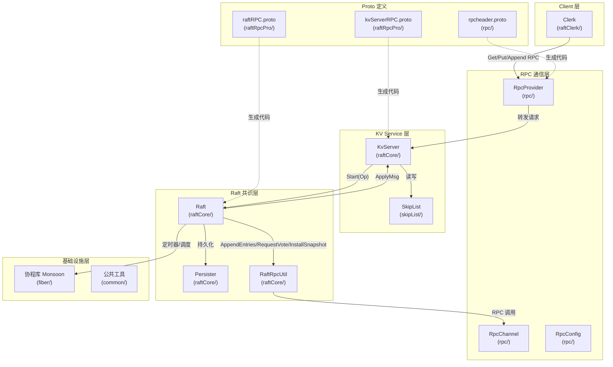
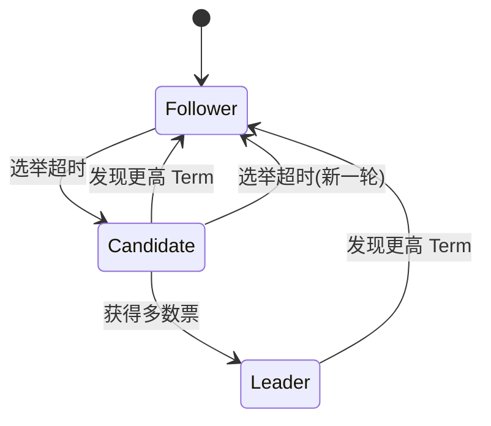
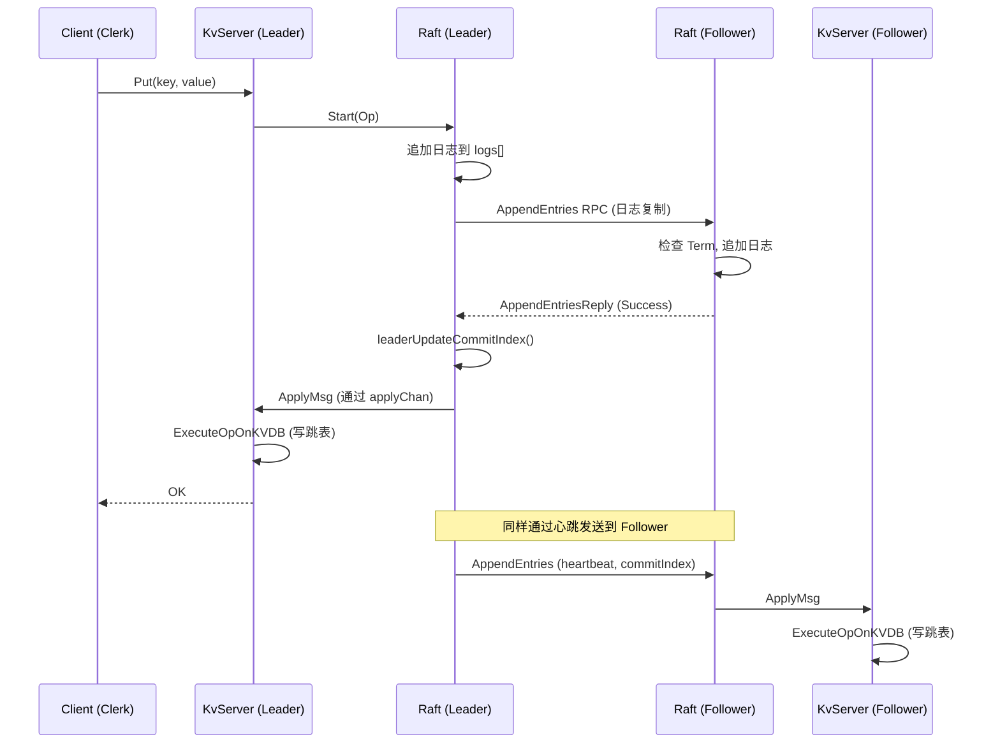
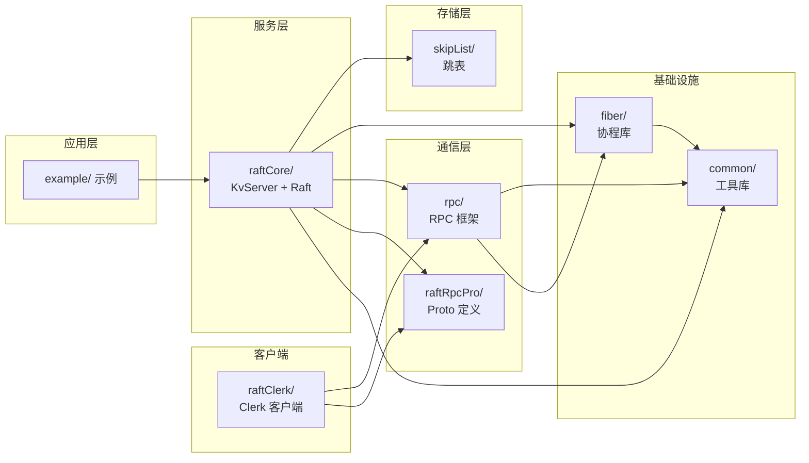

# KVstorageBaseRaft-cpp 项目架构文档

## 一、项目概述

本项目是一个基于 **Raft 一致性算法** 的分布式键值存储数据库的 C++ 实现。使用 C++20 标准，通过 Raft 共识协议在多个节点之间维护数据一致性，上层状态机使用**跳表（Skip List）** 作为存储引擎。

| 项目 | 说明 |
|------|------|
| **语言标准** | C++20 |
| **构建工具** | CMake (>= 3.22) |
| **共识算法** | Raft |
| **存储引擎** | 跳表（Skip List） |
| **RPC 框架** | 自研（基于 Protobuf + Muduo） |
| **序列化** | Protobuf + Boost.Serialization |
| **协程库** | 自研（基于 ucontext） |
| **代码格式化** | clang-format |

---

## 二、项目架构图（Mermaid）

### 2.1 整体架构



### 2.2 Raft 算法状态机



### 2.3 请求处理流程



---

## 三、目录结构与文件说明

```
KVstorageBaseRaft-cpp-main/
├── CMakeLists.txt                 # 根构建文件
├── README.md                      # 项目说明
├── format.sh                      # 代码格式化脚本
├── bin/
│   └── test.conf                  # 集群节点配置文件
├── docs/                          # 文档目录
├── src/                           # 源代码
│   ├── CMakeLists.txt             # 源码构建配置
│   ├── common/                    # 【公共工具模块】
│   ├── fiber/                     # 【协程库模块】
│   ├── rpc/                       # 【RPC 框架模块】
│   ├── raftRpcPro/                # 【Proto 定义模块】
│   ├── raftCore/                  # 【Raft 核心 + KV Server 模块】
│   ├── raftClerk/                 # 【客户端模块】
│   └── skipList/                  # 【跳表存储引擎模块】
├── example/                       # 示例代码
│   ├── raftCoreExample/           # Raft 集群启动 + Client 调用示例
│   ├── fiberExample/              # 协程库测试示例
│   └── rpcExample/                # RPC 框架测试示例
└── test/                          # 测试代码
```

---

### 3.1 根目录文件

| 文件 | 作用 |
|------|------|
| `CMakeLists.txt` | 顶层构建配置：设置 C++20 标准、全局 include 路径、链接 `muduo_net`、`muduo_base`、`pthread`、`dl`；定义子目录 `src/` 和 `example/`；定义格式化目标 |
| `README.md` | 项目介绍：背景、目的、技术栈、前置知识、学习指南、项目大纲 |
| `format.sh` | 调用 `clang-format` 格式化所有 `.h`、`.cpp` 源码文件 |
| `bin/test.conf` | 测试集群节点配置（IP + 端口），格式：`node{N}ip=IP`、`node{N}port=PORT` |

---

### 3.2 `src/common/` — 公共工具模块

提供全局使用的工具类、配置常量和调试函数。

| 文件 | 作用 |
|------|------|
| `include/config.h` | **全局配置常量**：`Debug` 开关、`HeartBeatTimeout`(25ms)、`ApplyInterval`(10ms)、选举超时范围 (300-500ms)、共识超时 (500ms)、协程线程数/调度配置 |
| `include/util.h` | **核心工具类**：<br>• `Op` 类—客户端操作命令（Put/Get/Append），支持 Boost.Serialization 序列化/反序列化<br>• `LockQueue<T>`—线程安全的阻塞队列（基于 `mutex` + `condition_variable`），带超时弹出<br>• `DeferClass<F>`—RAII 延迟执行工具（`DEFER` 宏）<br>• `DPrintf()`—带时间戳的调试打印 |
| `util.cpp` | `myAssert()`、`now()` 高精度时钟、`getRandomizedElectionTimeout()` 随机选举超时、`sleepNMilliseconds()`、端口可用性检测 |

---

### 3.3 `src/fiber/` — 协程库模块（Monsoon）

自研的 N:M 协程库，基于 `ucontext` 实现，提供协程、IO 管理器、定时器、线程封装。

| 文件 | 作用 |
|------|------|
| `include/monsoon.h` | 汇总头文件 |
| `include/fiber.hpp` | **协程定义**：基于 `ucontext` 的用户态协程，支持 `swapIn`/`swapOut`/`back` |
| `include/scheduler.hpp` | **N:M 协程调度器**：线程池 + 任务队列，`scheduler()` 添加协程/函数任务，`start()`/`stop()` 启停 |
| `include/iomanager.hpp` | **IO 管理器**（继承 Scheduler + TimerManager）：基于 `epoll` 的事件驱动 IO，管理 fd 的读写事件 |
| `include/timer.hpp` | **定时器管理**：基于小顶堆的定时器，支持添加/取消/获取下一个超时时间 |
| `include/thread.hpp` | **线程封装**：`Thread` 类包装 `std::thread`，支持命名和 `tid` 管理 |
| `include/mutex.hpp` | **协程级锁**：`Mutex`、`RWMutex`、`Semaphore`，协程等待时让出执行权 |
| `include/fd_manager.hpp` | **文件描述符管理**：`FdCtx` 管理 fd 属性（非阻塞、超时等），`FdManager` 单例 |
| `include/hook.hpp` | **系统调用 Hook**：hook `sleep`、`connect`、`socket` 等，使同步代码在协程中异步执行 |
| `include/singleton.hpp` | 单例模式模板基类 |
| `include/noncopyable.hpp` | 不可拷贝基类 |
| `include/utils.hpp` | `GetElapsedMS()`、`CondPanic()` 等工具函数 |
| `fiber.cpp` | 协程实现 |
| `scheduler.cpp` | 调度器实现 |
| `iomanager.cpp` | IO 管理器实现 |
| `timer.cpp` | 定时器实现 |
| `thread.cpp` | 线程实现 |
| `fd_manager.cpp` | fd 管理实现 |
| `hook.cpp` | Hook 实现 |
| `utils.cpp` | `GetThreadId()` |

---

### 3.4 `src/rpc/` — RPC 框架模块

自研的 RPC 框架，基于 Protobuf 序列化 + Muduo 网络库。

| 文件 | 作用 |
|------|------|
| `rpcheader.proto` | RPC 协议头：`service_name`、`method_name`、`args_size` |
| `include/rpcprovider.h` | **RPC 服务提供者**：`NotifyService()` 注册服务，`Run()` 启动 Muduo 服务器，接收并分发 RPC 请求 |
| `include/rpcchannel.h` | **RPC 通道**（客户端）：实现 `google::protobuf::RpcChannel`，封装 TCP 连接和请求发送 |
| `include/rpccontroller.h` | **RPC 控制器**：实现 `google::protobuf::RpcController`，管理 RPC 调用状态 |
| `include/rpcconfig.h` | **RPC 配置**：读取配置文件（键值对格式），提供 `Load()` 查询 |
| `rpcprovider.cpp` | 服务端实现 |
| `mprpcchannel.cpp` | 客户端通道实现 |
| `mprpccontroller.cpp` | 控制器实现 |
| `mprpcconfig.cpp` | 配置读取实现 |

---

### 3.5 `src/raftRpcPro/` — Proto 定义模块

定义 Raft 节点间通信和 KV Server 客户端通信的 Protobuf 协议。

| 文件 | 作用 |
|------|------|
| `raftRPC.proto` | **Raft 节点间 RPC 协议**：<br>• `LogEntry`—日志条目（Command + LogTerm + LogIndex）<br>• `AppendEntries`—日志复制/心跳 RPC<br>• `RequestVote`—请求投票 RPC<br>• `InstallSnapshot`—安装快照 RPC<br>• `service raftRpc`—Raft 节点间的三个 RPC 服务 |
| `kvServerRPC.proto` | **KV Server 客户端协议**：<br>• `GetArgs`/`GetReply`—读取请求/响应<br>• `PutAppendArgs`/`PutAppendReply`—写入/追加请求/响应<br>• `service kvServerRpc`—对外暴露的 RPC 服务 |

---

### 3.6 `src/raftCore/` — Raft 核心 + KV Server 模块 ⭐

**这是整个项目的核心模块**，包含 Raft 算法实现、KV 服务器和持久化层。

#### 3.6.1 头文件

| 文件 | 作用 |
|------|------|
| `include/raft.h` | **Raft 类（核心中的核心）**：继承 `raftRpc` 服务，实现完整 Raft 协议<br>• **关键成员**：`m_currentTerm`、`m_votedFor`、`m_logs`、`m_commitIndex`、`m_lastApplied`、`m_nextIndex[]`、`m_matchIndex[]`、`m_status`（Follower/Candidate/Leader）<br>• **关键方法**：`init()`、`Start()`、`AppendEntries1()`、`RequestVote()`、`InstallSnapshot()`、`doElection()`、`doHeartBeat()`、`leaderUpdateCommitIndex()`<br>• **内部类**：`BoostPersistRaftNode`—用于 Boost 序列化持久化 Raft 状态 |
| `include/kvServer.h` | **KvServer 类**：继承 `kvServerRpc`，连接 Raft 节点与跳表存储<br>• **关键成员**：`m_raftNode`（Raft 节点）、`m_skipList`（跳表）、`applyChan`（通信管道）、`waitApplyCh`（等待通道 map）、`m_lastRequestId`（幂等性）<br>• **关键方法**：`PutAppend()`、`Get()`、`ExecutePutOpOnKVDB()`、`ExecuteGetOpOnKVDB()`、`ExecuteAppendOpOnKVDB()` |
| `include/raftRpcUtil.h` | **RaftRpcUtil**：封装对远端 Raft 节点的 RPC 调用（`AppendEntries`、`RequestVote`、`InstallSnapshot`） |
| `include/Persister.h` | **Persister 类**：Raft 状态 + 快照的持久化，基于文件流读写 |
| `include/ApplyMsg.h` | **ApplyMsg 结构体**：Raft 向状态机提交的消息，包含 `CommandValid`（普通命令）和 `SnapshotValid`（快照命令）两种类型 |

#### 3.6.2 实现文件（关键逻辑）

| 文件 | 关键函数 | 作用 |
|------|----------|------|
| `raft.cpp` | `init()` | **初始化 Raft 节点**：读取持久化状态恢复，启动三个后台任务（leaderHearBeatTicker → 协程，electionTimeOutTicker → 协程，applierTicker → 线程） |
| | `doElection()` | **发起选举**：自增 Term，给自己投票，并行向所有节点发送 `RequestVote` RPC |
| | `RequestVote()` | **处理投票请求**：比较 Term、日志新旧度、是否已投票，决定是否授予投票 |
| | `sendRequestVote()` | **处理投票响应**：统计票数，过半即晋升为 Leader，初始化 `nextIndex`/`matchIndex` |
| | `doHeartBeat()` | **Leader 心跳/日志复制**：遍历所有 Follower，构造 `AppendEntries` 或 `InstallSnapshot`，并行发送 |
| | `AppendEntries1()` | **处理 AppendEntries**：Term 检查 → 日志匹配校验 → 截断/追加日志 → 更新 commitIndex，实现了**冲突快速回退优化** |
| | `sendAppendEntries()` | **处理 AE 响应**：更新 `matchIndex`/`nextIndex`，过半确认后推进 `commitIndex`（**仅当前 Term 日志可提交**） |
| | `leaderUpdateCommitIndex()` | Leader 计算新的 commitIndex（过半数 matchIndex ≥ index 且 logTerm == currentTerm） |
| | `getApplyLogs()` | 批量获取 `lastApplied` 到 `commitIndex` 之间已提交的日志 |
| | `applierTicker()` | 定时将已提交日志通过 `applyChan` 推送到 KvServer |
| | `persist()` / `persistData()` / `readPersist()` | 持久化 Raft 关键状态（currentTerm、votedFor、logs），使用 Boost.Serialization |
| | `Snapshot()` | 服务层主动触发日志压缩快照 |
| | `InstallSnapshot()` | 接收 Leader 的快照，截断日志并通知上层加载快照 |
| `kvServer.cpp` | `KvServer()` 构造函数 | 启动 RPC Provider（注册 KvServer + Raft 服务），读取配置连接各节点，初始化 Raft 节点，恢复快照 |
| | `PutAppend()` | 客户端写入入口：构造 `Op` → 调用 `Raft::Start()` → 等待 `waitApplyCh` → 超时重试/返回结果 |
| | `Get()` | 客户端读取入口：同样走 Raft 提交流程，保证**线性一致性读** |
| | `ReadRaftApplyCommandLoop()` | 从 `applyChan` 阻塞读取已提交消息，调用 `GetCommandFromRaft()` 执行 |
| | `GetCommandFromRaft()` | 解析命令，幂等性检查，**Put/Append 命令去重**，执行对应操作，通知等待的客户端 |
| | `ExecutePutOpOnKVDB()` | 调用 `SkipList::insert_set_element()` 写入跳表 |
| | `ExecuteGetOpOnKVDB()` | 调用 `SkipList::search_element()` 读取跳表 |
| | `IfNeedToSendSnapShotCommand()` | 当日志大小超过阈值，触发快照制作 |
| | `MakeSnapShot()` | 序列化跳表数据 + lastRequestId 制成快照 |
| `Persister.cpp` | `Save()` / `SaveRaftState()` / `ReadRaftState()` / `ReadSnapshot()` | 文件级别的持久化读写操作 |
| `raftRpcUtil.cpp` | 封装 Protobuf RPC 调用 | 通过 stub 对象发起 RPC 请求 |

---

### 3.7 `src/raftClerk/` — 客户端模块

| 文件 | 作用 |
|------|------|
| `include/clerk.h` | **Clerk 类**：分布式 KV 客户端，`Init()` 连接所有节点，`Get()`/`Put()`/`Append()` 对外 API |
| `include/raftServerRpcUtil.h` | **raftServerRpcUtil**：封装对 KvServer 节点的 RPC 调用（`Get`、`PutAppend`） |
| `clerk.cpp` | Clerk 实现：<br>• `Get()`—向 `recentLeaderId` 发送请求，失败则轮询重试其他节点<br>• `PutAppend()`—写入/追加命令，带请求 ID 保证幂等<br>• `Init()`—读取配置文件，连接所有 KvServer 节点 |

---

### 3.8 `src/skipList/` — 跳表存储引擎模块

| 文件 | 作用 |
|------|------|
| `include/skipList.h` | **SkipList<K,V> 模板类**：<br>• `insert_element()`—插入键值对（带 mutex 锁）<br>• `search_element()`—搜索键<br>• `delete_element()`—删除键<br>• `insert_set_element()`—存在则更新，不存在则插入<br>• `dump_file()`—序列化为字符串（使用 Boost.Serialization + `SkipListDump` 辅助类）<br>• `load_file()`—从字符串反序列化恢复<br>• 内部 `Node<K,V>` 类—跳表节点（key、value、forward 指针数组）<br>• 随机层高算法（概率 1/2 递增） |

---

### 3.9 `example/` — 示例代码

| 文件 | 作用 |
|------|------|
| `raftCoreExample/raftKvDB.cpp` | **启动 Raft 集群**：用 `fork()` 创建 N 个子进程，每个进程启动一个 `KvServer` 节点，端口自动分配 |
| `raftCoreExample/caller.cpp` | **客户端调用示例**：创建 `Clerk`，循环执行 `Put`/`Get` 500 次 |
| `fiberExample/` | 协程库的 IO 服务器、Hook 测试、调度器测试、线程测试 |
| `rpcExample/` | RPC 框架的服务端/客户端示例（好友服务） |

---

### 3.10 `test/` — 测试代码

提供项目的基础测试用例（具体内容见 `test/readme.md`）。

---

## 四、模块依赖关系



---

## 五、数据流与关键机制

### 5.1 写请求完整流程

```
Client.Clerk.Put(key, value)
  → raftServerRpcUtil.PutAppend()           [RPC 调用]
    → KvServer::PutAppend()                  [接收入口]
      → Raft::Start(Op)                      [提交流程]
          - 将 Op 序列化为 LogEntry 追加到 m_logs
          - 等待下次 leaderHearBeatTicker() 触发 doHeartBeat()
      → doHeartBeat()                        [Leader 定时触发]
          → sendAppendEntries()              [并行发送给所有 Follower]
            → RaftRpcUtil.AppendEntries()    [RPC]
              → Follower::AppendEntries1()   [远端处理]
                  - 检查 Term
                  - 匹配日志（冲突检测 + 快速回退优化）
                  - 追加/截断日志
                  - 更新 commitIndex
              ← AppendEntriesReply           [RPC 返回]
            → 统计过半确认 → 更新 matchIndex/nextIndex
            → leaderUpdateCommitIndex()      [当前 Term 日志过半即提交]
      → applierTicker()                      [定时 apply]
          → getApplyLogs(): m_lastApplied → m_commitIndex
          → applyChan.Push(ApplyMsg)         [推送到 KvServer]
    → KvServer::ReadRaftApplyCommandLoop()    [消费管道]
        → GetCommandFromRaft(message)
          - 幂等性检查（ifRequestDuplicate）
          - ExecutePutOpOnKVDB(op): skipList.insert_set_element()
        → SendMessageToWaitChan(op, index)    [通知等待的 RPC 线程]
    ← PutAppendReply(OK)                     [RPC 返回]
  ← Client 收到 OK
```

### 5.2 读请求完整流程（线性一致性读）

```
Client.Clerk.Get(key)
  → raftServerRpcUtil.Get()                  [RPC]
    → KvServer::Get()
      → Raft::Start(Op)                     [读请求也走 Raft 提交]
      → 等待 waitApplyCh（共识超时内）
        - 收到提交：ExecuteGetOpOnKVDB() → 返回结果
        - 超时 + 已提交：直接执行 Get（线性一致性保证）
        - 超时 + 未提交：返回 ErrWrongLeader
```

### 5.3 选举流程

```
electionTimeOutTicker()                      [后台协程]
  → 睡眠 [300ms, 500ms] 随机超时
  → 超时未收到心跳
    → doElection()
      - m_status → Candidate
      - m_currentTerm++
      - m_votedFor = m_me
      - persist()
      - 并行发送 RequestVote 给所有节点
        → sendRequestVote()                  [回调处理]
          - 检查 reply.term
          - votedNum >= peers/2 + 1？
            → 晋升为 Leader
            → 初始化 nextIndex/matchIndex
            → 立即发送 doHeartBeat()
```

---

## 六、项目学习路线

### 📚 第一阶段：基础知识储备（1-2 周）

在阅读本项目代码之前，需要掌握以下前置知识：

| 序号 | 知识点 | 说明 |
|------|--------|------|
| 1 | **C++ 基础** | `mutex`、`lock_guard`、`unique_lock`、`condition_variable`、`shared_ptr`、`thread`、RAII |
| 2 | **Raft 算法** | 阅读 [Raft 论文](https://raft.github.io/raft.pdf) 或 Raft 可视化动画，理解 Leader Election、Log Replication、Safety |
| 3 | **Protobuf** | 了解 `.proto` 文件定义、`service`/`rpc`、序列化/反序列化 |
| 4 | **RPC 概念** | 理解 RPC（Remote Procedure Call）的基本原理 |
| 5 | **CMake** | 了解 `CMakeLists.txt` 基本语法、`add_subdirectory`、`target_link_libraries` |
| 6 | **跳表** | 了解 Skip List 的数据结构原理（插入/查找/删除 O(log n)） |

**推荐资源**：
- Raft 论文：https://raft.github.io/raft.pdf
- Raft 动画：http://thesecretlivesofdata.com/raft/
- MIT 6.824 课程（作为进阶参考）

---

### 📖 第二阶段：基础组件阅读（1 周）

**按依赖关系从底层到上层**：

```
1️⃣  common/config.h        → 了解全局配置常量
2️⃣  common/util.h          → 学习 LockQueue、Op 类、DEFER 宏
3️⃣  common/util.cpp        → 阅读工具函数实现

4️⃣  rpc/                   → 了解 RPC 框架结构
    ├── rpcheader.proto     → RPC 协议头定义
    ├── rpcprovider.h/cpp   → 服务端：注册服务、启动监听
    ├── mprpcchannel.h/cpp  → 客户端：建立连接、发送请求
    └── mprpcconfig.h/cpp   → 配置文件读取

5️⃣  fiber/                 → 了解协程库结构
    ├── scheduler.hpp       → N:M 调度器设计
    ├── iomanager.hpp       → epoll IO 管理
    └── timer.hpp           → 定时器实现
```

**学习要点**：
- `LockQueue<T>` 的阻塞队列实现（生产者-消费者模式）
- `Op` 类的序列化机制（Boost.Serialization）
- RPC 框架如何用 Protobuf + Muduo 实现请求分发
- 协程库如何基于 `ucontext` 实现用户态切换

---

### 🎯 第三阶段：Raft 算法核心（2-3 周）⭐ 重点

这是整个项目最核心的部分，建议按照 Raft 论文的结构顺序阅读：

```
📌 第 1 步：理解数据结构
  → raft.h           # 阅读 Raft 类的成员变量，对照 Raft 论文 Figure 2
  → ApplyMsg.h       # Raft 和状态机之间的消息类型
  → raftRPC.proto    # Raft 节点间的 RPC 消息定义

📌 第 2 步：Leader Election（领导者选举）
  → raft.cpp: init()                  # Raft 节点初始化
  → raft.cpp: electionTimeOutTicker() # 选举超时检测
  → raft.cpp: doElection()            # 发起选举
  → raft.cpp: RequestVote()           # 处理投票请求（Follower 视角）
  → raft.cpp: sendRequestVote()       # 处理投票响应（Candidate 视角）

📌 第 3 步：Log Replication（日志复制）
  → raft.cpp: doHeartBeat()           # Leader 定期发送心跳/日志
  → raft.cpp: AppendEntries1()        # Follower 处理 AE 请求
  → raft.cpp: sendAppendEntries()     # Leader 处理 AE 响应
  → raft.cpp: getPrevLogInfo()        # 获取前一条日志信息
  → raft.cpp: matchLog()              # 日志匹配检查

📌 第 4 步：Commit & Apply（提交与应用）
  → raft.cpp: leaderUpdateCommitIndex() # Leader 更新 commitIndex
  → raft.cpp: getApplyLogs()            # 获取待应用的日志
  → raft.cpp: applierTicker()           # 定时推送到状态机

📌 第 5 步：Persistence & Snapshot（持久化与快照）
  → Persister.h/cpp                  # 文件持久化实现
  → raft.cpp: persist() / persistData() / readPersist()  # Raft 状态持久化
  → raft.cpp: Snapshot()             # 制作快照
  → raft.cpp: InstallSnapshot()      # 安装快照
  → raft.cpp: leaderSendSnapShot()   # Leader 发送快照
```

**学习要点**：
- Term 如何保证全局时序
- 日志匹配的**冲突快速回退优化**（`updatenextindex`）
- **只有当前 Term 的日志才能提交**（Raft 安全性保证）
- `commitIndex` 的推进机制
- 快照截断日志的逻辑

---

### 🔗 第四阶段：KV Server 集成（1 周）

阅读 Raft 与上层状态机、客户端的交互：

```
📌 第 1 步：Protobuf 定义
  → kvServerRPC.proto       # KV Server 的 RPC 协议

📌 第 2 步：KvServer 核心逻辑
  → kvServer.h              # KvServer 类定义
  → kvServer.cpp: KvServer() 构造函数  # 启动流程
  → kvServer.cpp: PutAppend() / Get()  # 客户端请求入口
  → kvServer.cpp: ReadRaftApplyCommandLoop()  # Raft 消息消费循环
  → kvServer.cpp: GetCommandFromRaft() # 命令分发与执行

📌 第 3 步：状态机操作
  → ExecutePutOpOnKVDB()    # 写跳表
  → ExecuteGetOpOnKVDB()    # 读跳表
  → ExecuteAppendOpOnKVDB() # 追加写跳表

📌 第 4 步：幂等性与快照
  → ifRequestDuplicate()    # 请求去重（线性一致性保证）
  → MakeSnapShot() / ReadSnapShotToInstall()  # KV 快照序列化
```

**学习要点**：
- KvServer 如何通过 `applyChan` + `waitApplyCh` 双通道与 Raft 交互
- 线性一致性读的实现：读请求也走 Raft 提交流程
- 幂等性保证：通过 `ClientId + RequestId` 去重
- 快照格式：由 KvServer 定义，Raft 只负责透明传递

---

### 🖥️ 第五阶段：客户端与集成运行（2-3 天）

```
📌 Clerk 客户端
  → raftClerk/include/clerk.h         # Clerk 类定义
  → raftClerk/clerk.cpp               # Get/Put/Append 实现
  → raftClerk/include/raftServerRpcUtil.h  # KvServer RPC 工具

📌 运行示例
  → example/raftCoreExample/raftKvDB.cpp   # 多节点集群启动
  → example/raftCoreExample/caller.cpp     # 客户端调用
  → bin/test.conf                          # 集群配置
```

**运行方式**：
```bash
mkdir build && cd build
cmake ..
make
# 启动 3 节点集群
./bin/raftKvDB -n 3 -f ./bin/test.conf
# 另一个终端启动客户端
./bin/caller
```

---

### 🚀 第六阶段：进阶优化方向

| 方向 | 说明 |
|------|------|
| **日志复制优化** | 实现 pipeline 批量发送、snappy 压缩 |
| **读优化** | 实现 ReadIndex / Lease Read 避免每次都走 Raft 提交 |
| **成员变更** | 实现 Raft 论文第 6 章的 Joint Consensus |
| **PrevVote** | 防止网络分区节点恢复后打断正常集群 |
| **No-op 日志** | Leader 上任后提交一条空日志来提交之前 Term 的日志 |
| **存储引擎替换** | 将跳表替换为 RocksDB / LevelDB |
| **监控与运维** | 添加 metrics 暴露、健康检查接口 |

---

## 七、关键设计决策

| 决策 | 说明 |
|------|------|
| **读操作走 Raft** | 保证线性一致性，读请求也会作为 LogEntry 提交 |
| **心跳即日志复制** | Leader 的心跳 `doHeartBeat()` 同时完成日志复制，减少 RPC 次数 |
| **冲突快速回退** | `AppendEntries1` 返回冲突 Term 的第一个 index，减少 RPC 轮次 |
| **当前 Term 提交限制** | 只有当前 Term 的日志过半才推进 commitIndex，保证 Leader Completeness |
| **随机选举超时** | 300-500ms 随机化，避免多个节点同时发起选举 |
| **双通道通信** | `applyChan`（Raft→KvServer）+ `waitApplyCh`（KvServer→等待线程） |
| **Mutex 锁范围** | 仅在访问共享状态时加锁，RPC 调用在锁外执行，避免死锁 |

---

## 八、常见面试问题

1. **Raft 如何保证线性一致性读？** — 读请求也走 Raft 日志提交，Leader 确认自己仍是 Leader 后才返回
2. **如何处理网络分区？** — Term 机制保证旧 Leader 无法提交新日志
3. **Follower 日志冲突如何处理？** — `updatenextindex` 快速回退到冲突 Term 的第一个 index
4. **为什么只有当前 Term 才能提交？** — 防止已被提交的日志被新 Leader 覆盖（图 8 问题）
5. **快照的作用是什么？** — 压缩日志，防止日志无限增长，加速新节点追赶
6. **跳表 vs 哈希表的优劣？** — 跳表支持范围查询、有序遍历，实现简单
